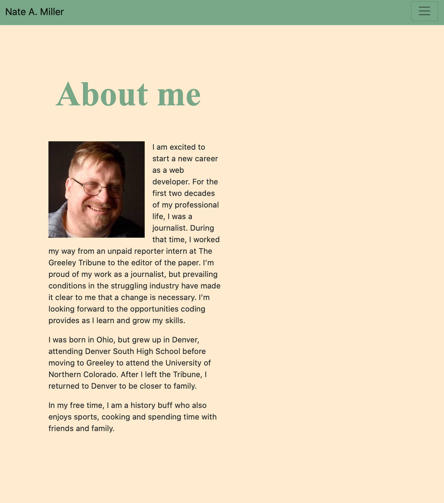

# Portfolio

For this web application, I created a portoflio that conists of three pages — an "about me," a "portfolio" and a "contact" page.

# Installation/Usage

To view this website, simply load https://nmiller2379.github.io/Portfolio.io/ in your web browser.

# Functionality

I created the application using Bootstrap to allow for a clean, efficient and mobile responsive design. Bootstrap allowed for a functional nav bar that is consistent on all three pages and responsive as the browser size changes. It also allowed for the creation of a sticky footer on the bottom of each page. Bootstrap grids enabled the creation of the "portfolio" page and a bootstrap form allowed for the creation of the "contact page."
